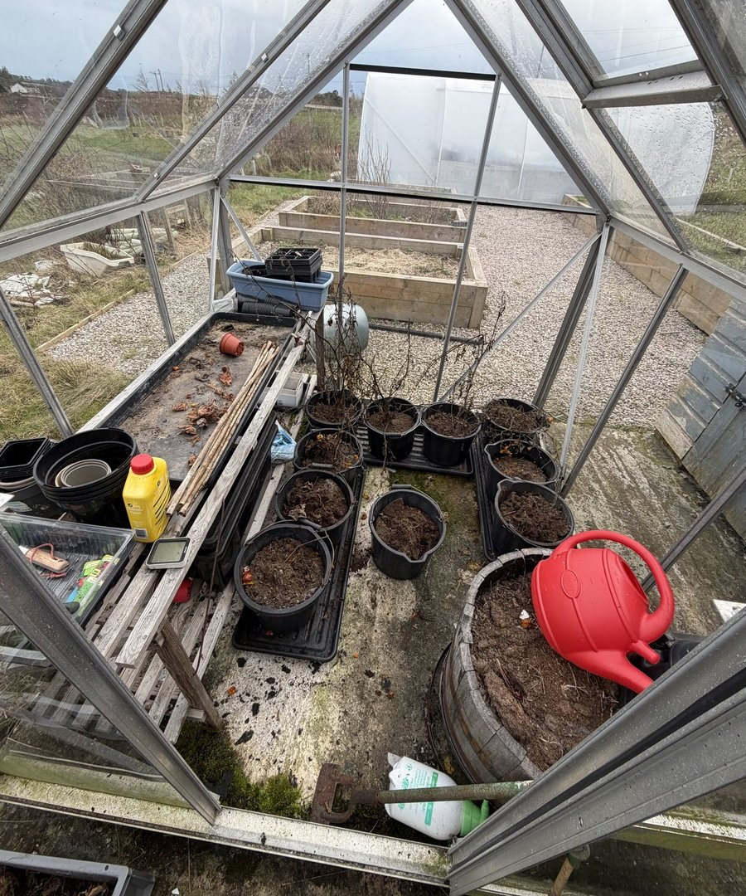
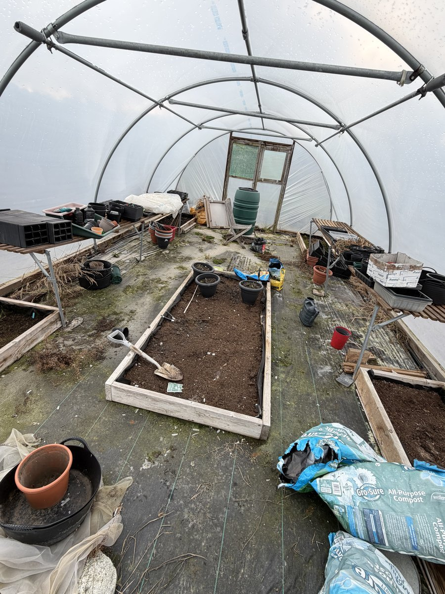

First time in the greenhouse and polytunnel today and honestly, it was a bit of a state. Full of spiders, old plants from last season, and that general feeling of "where do I even start?" But the sun was out and I had the afternoon free, so in I went.

## The Greenhouse

I spent the first half hour or so just pulling out old **tomato** plants and **peppers** from last year. I was very late starting last season — we did get tomatoes but I should have got a lot more, given that the cold weather starts quicker up here in Scotland. I'm determined not to make the same mistake this year.

I've broken down all the old compost, removed the roots, and the pots are sitting ready for new plants. I'll need to get some fresh compost to top them up but it's looking a lot tidier and I don't think I've been this prepared in years.

The good news? A couple of **grape trees** I bought in the sale at the end of last season have started budding, and an old **rhubarb** plant that's been dormant all winter is showing signs of life too. Good to see.

## The Polytunnel

Then I shifted across into the polytunnel. It's definitely taken a battering from the winter winds — the tape that stops the polythene rubbing has started peeling off in places, so I'll need to sort that out before it causes any real damage.

I got all the shelving tidied up, got rid of the old plants, sprayed round the outside where weeds were trying their luck, and pulled out the couch grass that seeds itself in the raised beds every year without fail. There's been signs of mice in there too — not ideal. I also chucked out a few plant pots that had cracked from the frost over winter.

The raised beds are going to need more compost — everything's reduced down and rotted away over winter. I'll need seeding compost as well, and I definitely need to start thinking about what seeds to buy.

## About Those Seeds...

I actually had seeds. Bought them at the end of last season and took them outside with me. Unfortunately, I found the envelope sitting outside the greenhouse. Not very clever. So I'm starting from scratch on the seed front.

## What's Next

The greenhouse and polytunnel are looking rearing to go — I just need compost, seeds, and a bit of repair tape. I'm hoping to get **tomatoes** and **peppers** started early this year and actually make the most of the growing season. Fingers crossed 🤞
