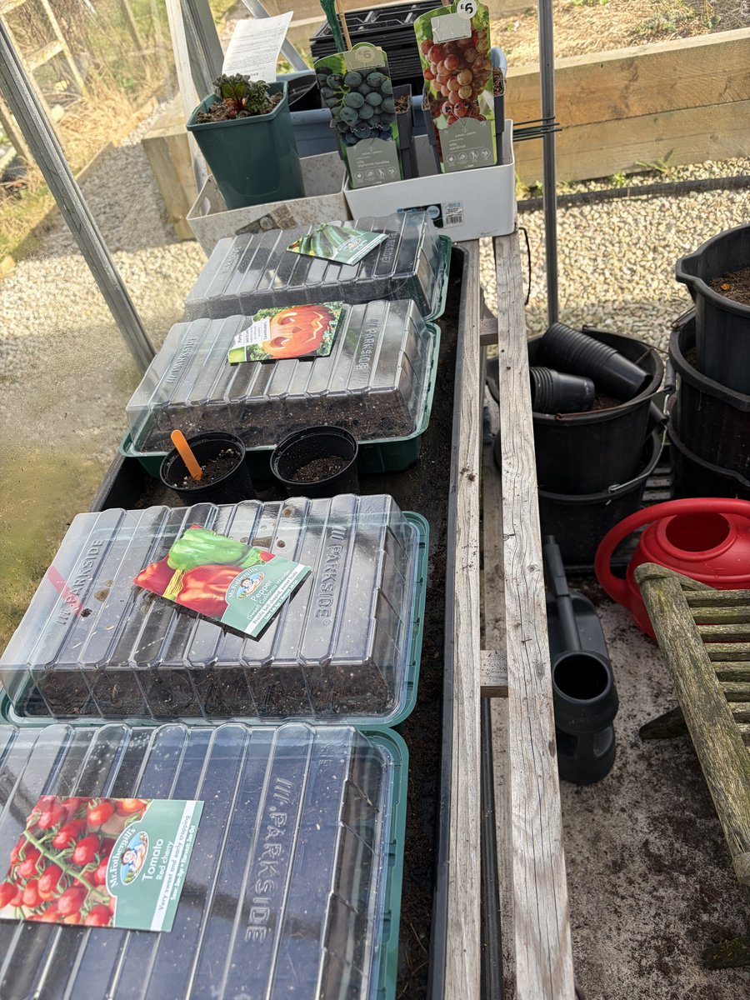

Gorgeous day out there today — 12°C, clear sky, birds absolutely going for it in the trees. I couldn't sit inside any longer so I headed out to the greenhouse to get the first seeds of the season in. And I wasn't alone — Eddie the cat decided he was coming too.

## What Went In

I got stuck in and planted:

- **Cherry tomatoes**
- **Peppers**
- **Courgettes**
- **Pumpkin** seeds — yes, I know, probably a bit adventurous for late March in Scotland

Everything went into propagator trays with lids on the greenhouse bench. The greenhouse should give them enough warmth to get going, and I'll keep an eye on the temperatures overnight. Last year I was way too late getting started so I'm determined to be ahead of the game this time round.

The pumpkins are a gamble, I'll admit. But they were sitting there in the packet looking at me and I thought, why not? Worst case they don't come to anything and I try again in April.

## Eddie the Supervisor

Eddie was up on the bench within about thirty seconds, sniffing everything and generally getting in the way. He's not exactly what you'd call helpful, but he's good company. Tried to sit in one of the seed trays at one point — had to shift him before he flattened the lot.

## Spring Is Here

The daffodils are properly out now and the garden is starting to look alive again. After last week's [tidy-up](/blog/2026-03-15-spring-tidy-up/), having seeds actually in compost feels like real progress. Totally buzzing to get the season going.

Next up I'll be keeping an eye on germination and hoping the greenhouse stays warm enough overnight. Fingers crossed for some wee green shoots in a week or two 🌱
