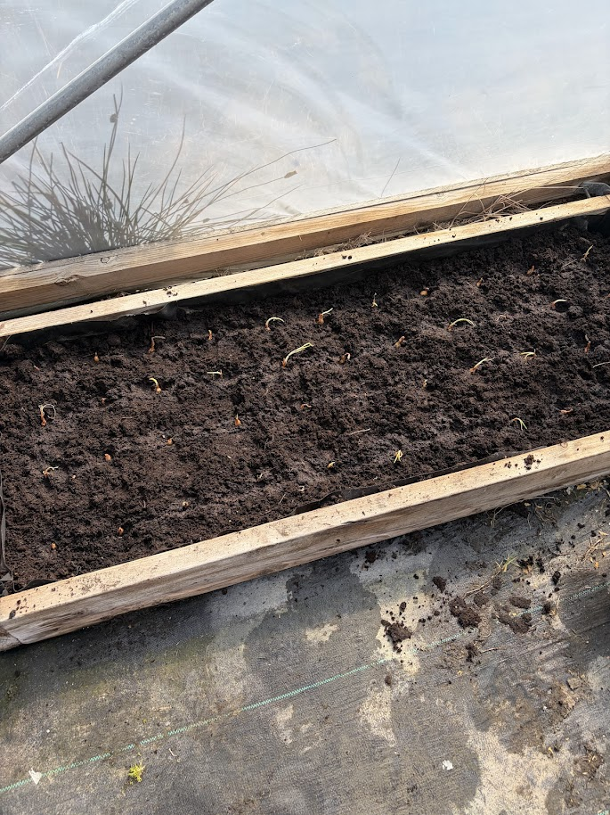
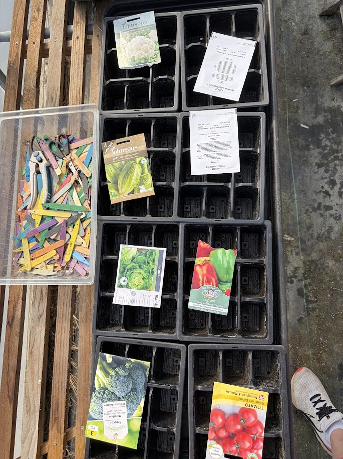
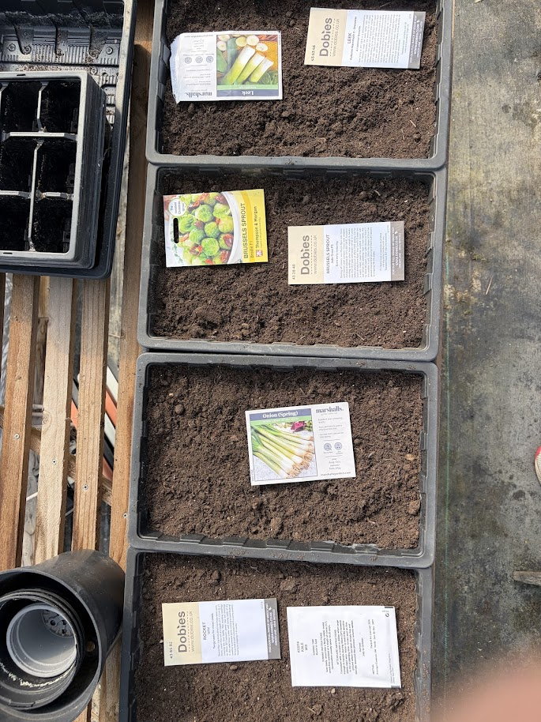
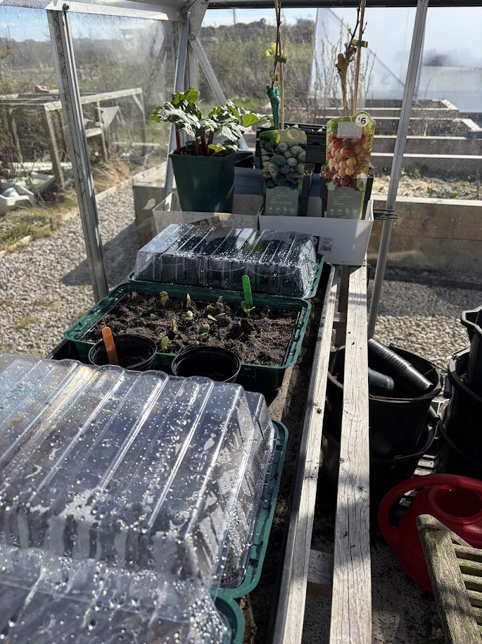

Right, what a day. The sun was out in Aberdeen — 9°C and partly cloudy, which by our standards is practically tropical — so I made the most of it.

First job was checking on the pumpkin seeds I planted a couple of weeks back. I'm chuffed to bits because they're actually growing. Little green shoots pushing through the compost, doing their thing. I know it's early days but seeing anything come up at all feels like a win. Pumpkins in Aberdeen — we'll see how that goes.

From there I shifted across to the polytunnel. I gave it a good clean about four weeks ago and since then I've been getting it properly stocked up. I've got leeks (Musselburgh), Brussels sprouts (Groninger), spring onions (White Lisbon) and lettuce all sown into trays. Everything's sitting nicely in there and the polytunnel's doing its job keeping things warm. Good to see it all coming together after the big tidy-up.

Outside, I finally cut the grass for the first time this year. It was well overdue — the lawn was looking more like a meadow than a garden. But it's done now and it makes such a difference having everything neat again. I also went round and sprayed all the weeds while I was at it. Might as well get the lot done in one go.

And then, because apparently I hadn't done enough for one day, I planted some onions. Now look — I know it's probably far too late for onions. I'm fully aware that most sensible folk had theirs in weeks ago. But I had the sets, the ground was ready, and I'm an optimist. Fingers crossed they surprise me. If not, lesson learned for next year.

All in all, a cracking day in the garden. The polytunnel's filling up, the pumpkins are alive, and the grass is finally respectable. Next up is keeping an eye on those seedlings and hoping the Aberdeen weather plays ball. 🌱
